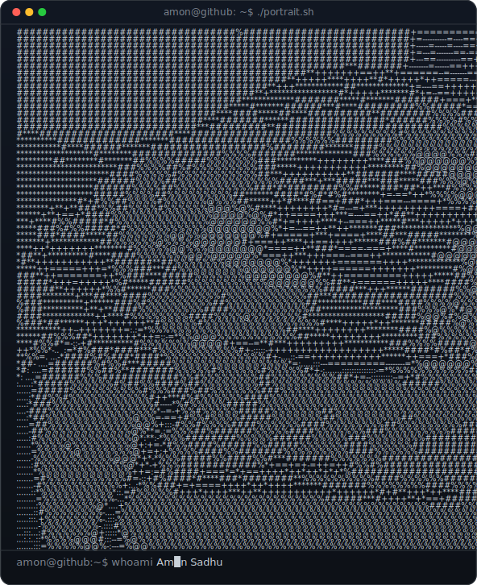
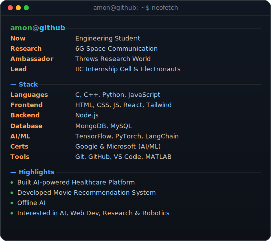

<h1 align="center">Amon Sadhu</h1>

AI | Full Stack | Research | Robotics | Orator

  <a href="https://www.linkedin.com/in/amon-sadhu-7bbb7629a/">LinkedIn</a> ·

<table>
<tr>
<td width="370" valign="top">
  
</td>
<td width="540" valign="top">
  
</td>
</tr>
</table>

---

### About

Engineering student working across **AI, full-stack development, robotics,
and research** — currently researching 6G space communication, serving as a
Campus Ambassador for Threws Research World, and leading the IIC Internship
Cell & Electronauts. I build AI-powered platforms and web apps, with
hardware/robotics projects on the side.

- **AI/ML:** Python, TensorFlow, PyTorch, LangChain
- **Web:** HTML, CSS, JS, React, Tailwind, Node.js, MongoDB, MySQL
- **Languages:** C, C++, Python, JavaScript
- **Tools:** Git, GitHub, VS Code, MATLAB
- Google & Microsoft certified in AI/ML

 and when I'm not building things, I'm probably planning my next trip or hunting down the best food in town — always up for both.

---

This profile refreshes itself daily — see <code>.github/workflows/update-profile-art.yml</code>.

